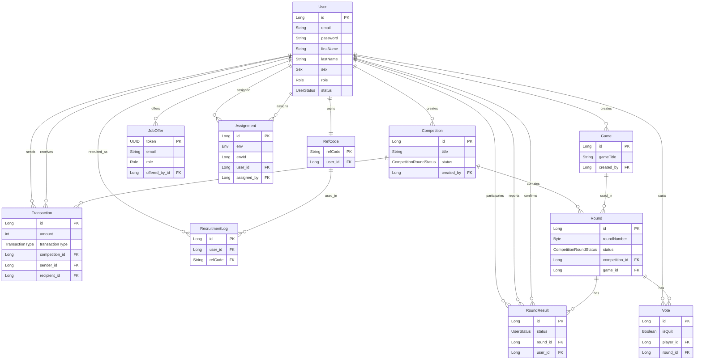

# Database Schema Documentation

This document describes the database schema for the Squid Game Management System, based on the JPA entities found in the codebase.

## Entities

### 1. User
Represents a user in the system (Player, Admin, etc.).
- **Table**: `users`
- **Primary Key**: `id` (Long, Auto-increment)
- **Attributes**:
    - `email` (String, Unique, Not Null, Length: 100)
    - `password` (String, Not Null)
    - `firstName` (String, Not Null)
    - `lastName` (String, Not Null)
    - `profilePhoto` (String, Not Null)
    - `sex` (Enum: `Sex`, Not Null)
    - `birthday` (Date, Not Null)
    - `balance` (Long)
    - `role` (Enum: `Role`, Not Null)
    - `status` (Enum: `UserStatus`, Not Null, Length: 25)
    - `createdAt` (Long, Not Null)
    - `updatedAt` (Long, Not Null)

### 2. Competition
Represents a competition instance.
- **Table**: `competitions`
- **Primary Key**: `id` (Long, Auto-increment)
- **Attributes**:
    - `title` (String)
    - `lobbyId` (Long)
    - `currentRoundId` (Long)
    - `status` (Enum: `CompetitionRoundStatus`, Not Null, Length: 25)
    - `createdAt` (Long)
    - `updatedAt` (Long)
- **Foreign Keys**:
    - `created_by` -> `User.id`

### 3. Round
Represents a specific round within a competition.
- **Table**: `rounds`
- **Primary Key**: `id` (Long, Auto-increment)
- **Attributes**:
    - `roundNumber` (Byte, Not Null)
    - `status` (Enum: `CompetitionRoundStatus`, Not Null, Length: 25)
    - `startedAt` (Long)
    - `endedAt` (Long)
- **Foreign Keys**:
    - `competition_id` -> `Competition.id` (Not Null)
    - `game_id` -> `Game.id` (Not Null)

### 4. Game
Represents a game definition (e.g., "Red Light, Green Light").
- **Table**: `games`
- **Primary Key**: `id` (Long, Auto-increment)
- **Attributes**:
    - `gameTitle` (String, Not Null)
    - `description` (String, Not Null)
    - `gameDuration` (Byte, Not Null)
    - `createdAt` (Long, Not Null)
    - `updatedAt` (Long, Not Null)
- **Foreign Keys**:
    - `created_by` -> `User.id` (Not Null)

### 5. RoundResult
Stores the result of a user in a specific round.
- **Table**: `round_results`
- **Primary Key**: `id` (Long, Auto-increment)
- **Attributes**:
    - `status` (Enum: `UserStatus`, Not Null, Length: 25)
    - `reportedAt` (Long)
    - `confirmedAt` (Long)
- **Foreign Keys**:
    - `round_id` -> `Round.id`
    - `user_id` -> `User.id`
    - `reported_by` -> `User.id`
    - `confirmed_by` -> `User.id`
- **Constraints**:
    - Unique constraint on (`round_id`, `user_id`)

### 6. Vote
Represents a vote cast by a player in a round (likely for ending the game).
- **Table**: `votes`
- **Primary Key**: `id` (Long, Auto-increment)
- **Attributes**:
    - `isQuit` (Boolean)
- **Foreign Keys**:
    - `player_id` -> `User.id`
    - `round_id` -> `Round.id`
- **Constraints**:
    - Unique constraint on (`round_id`, `player_id`)

### 7. Transaction
Records financial transactions between users or system.
- **Table**: `transactions`
- **Primary Key**: `id` (Long, Auto-increment)
- **Attributes**:
    - `amount` (int, Not Null)
    - `transactionType` (Enum: `TransactionType`, Not Null)
    - `createdAt` (Long, Not Null)
- **Foreign Keys**:
    - `competition_id` -> `Competition.id` (Not Null)
    - `sender_id` -> `User.id` (Not Null)
    - `recipient_id` -> `User.id`

### 8. RefCode
Referral codes linked to users.
- **Table**: `ref_codes`
- **Primary Key**: `refCode` (String, Unique, Not Null)
- **Foreign Keys**:
    - `user_id` -> `User.id` (Not Null, Unique)

### 9. RecruitmentLog
Logs usage of referral codes.
- **Table**: `recruitment_logs`
- **Primary Key**: `id` (Long, Auto-increment)
- **Attributes**:
    - `createdAt` (Long)
- **Foreign Keys**:
    - `user_id` -> `User.id` (Not Null) - Referred player
    - `refCode` -> `RefCode.refCode` (Not Null)

### 10. JobOffer
Represents a job offer sent to an email.
- **Table**: `job_offers`
- **Primary Key**: `token` (UUID)
- **Attributes**:
    - `lobbyId` (Long, Not Null)
    - `role` (Enum: `Role`, Not Null)
    - `email` (String, Unique, Not Null)
    - `offerStatus` (Enum: `JobOfferStatus`, Not Null)
    - `createdAt` (Long, Not Null)
    - `updatedAt` (Long)
- **Foreign Keys**:
    - `offered_by_id` -> `User.id`

### 11. Assignment
Represents an assignment of a user to an environment (e.g., specific task or location).
- **Table**: `assignments`
- **Primary Key**: `id` (Long, Auto-increment)
- **Attributes**:
    - `env` (Enum: `Env`, Not Null)
    - `envId` (Long, Not Null)
    - `assignedAt` (Long, Not Null)
- **Foreign Keys**:
    - `user_id` -> `User.id` (Not Null)
    - `assigned_by` -> `User.id`

## Entity Relationship Diagram

